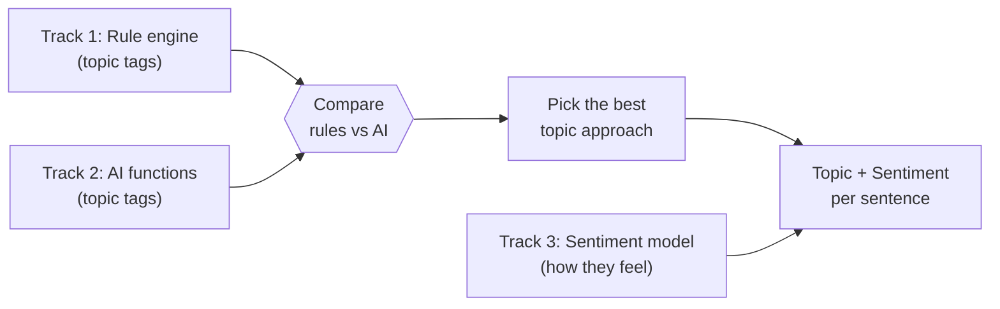
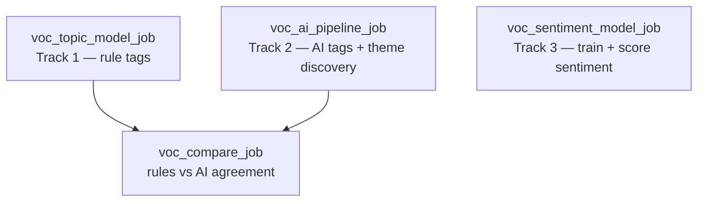

# GM Voice of Customer (VOC) — Databricks POC

A proof of concept for tagging GM contact-center call transcripts on
**Databricks**, to see whether it can match GM's current **Qualtrics XM Discover**
setup. Everything works at the **sentence level**: each sentence gets a topic
and, optionally, a sentiment.

## The three tracks

Two of the tracks do the **same job** (topic tagging) in different ways, so we
can **compare them and pick the best**. The third track does a **different job**
(sentiment) and is meant to be **used alongside** whichever topic track wins.

| Track | Job it does | How it works | Role |
|-------|-------------|--------------|------|
| **1 — Rule engine** | Topic tagging | Keyword/boolean rules (the same logic GM uses today). Same answer every time; easy to explain. | Compared with Track 2 |
| **2 — AI functions** | Topic tagging (+ can discover new topics) | Databricks AI functions: an LLM reads each sentence and picks a topic; can also group sentences into new themes it finds on its own. | Compared with Track 1 |
| **3 — Sentiment model** | Sentiment (how the customer feels) | A trained model that rates each sentence from Very Negative to Very Positive. | Used together with Track 1 or 2 |

**How to read this:** Track 1 vs. Track 2 is a **bake-off** for topic tagging — a
separate comparison job scores how much they agree and where they differ, so GM
can choose one (or blend them). Track 3 is **complementary**: it adds "how does
the customer feel?" on top of "what are they talking about?"



---

## The four topics we tag

Chosen from GM's topic hierarchy because they have enough volume to test with:

1. Contact Center → Dissatisfied With Advisor → **Confusing / Makes No Sense**
2. Contact Center → Dissatisfied With Advisor → **Inaccurate Information**
3. Loyalty → Rewards → **Points**
4. Loyalty → Rewards → Points → **Redeem**

Before tagging, we keep only **English, audio, customer-side** sentences (and
drop automated/IVR boilerplate).

---

## What each track does, in plain terms

**Track 1 — Rule engine.** Re-creates GM's existing keyword rules (words that
must appear, words that must not, phrases, wildcards, "these words near each
other"). It's deterministic (same input → same output) and fully explainable —
you can see exactly which words triggered a tag. Downside: someone has to
maintain the rules, and it misses wording the rules didn't anticipate.

**Track 2 — AI functions.** Uses Databricks' built-in AI functions. An LLM
(`ai_classify`) reads a sentence and assigns it to one of the four topics. A
second capability (`ai_query` embeddings + clustering + `ai_gen`) can **discover
new themes** that nobody wrote rules for. Downside: costs a bit per call and
isn't perfectly repeatable.

**Track 3 — Sentiment model.** A trained model (fine-tuned DistilBERT) that
rates each sentence's sentiment on a 5-point scale (Very Negative → Very
Positive), with a simple word-list ("VADER") version as a baseline to compare
against. It's registered in MLflow so GM would own it and run it cheaply.
Because we have no labeled examples yet, we bootstrap training labels with an
LLM — so treat it as a starting model to refine once people review real data.

---

## Repository layout

```
gm_voc/
├── rule_engine/     Track 1 — the rule engine + its Databricks job
├── ai_solution/     Track 2 — the AI-function jobs + the compare job
├── sentiment_model/ Track 3 — the sentiment training + scoring jobs
├── shared/          rules.json (the topic rules) + helper scripts
├── docs/            architecture diagrams + write-ups
├── test_data/       sample + demo CSVs
└── databricks.yml   Databricks Asset Bundle (defines the jobs)
```

The rule logic is plain Python (no Spark), so the **same code** runs at scale on
Databricks and can be tested on a laptop.

---

## Data

- **Inputs:** a sentence-level transcript table and a call-level metadata table.
- **Join:** `sentence.natural_id == metadata.natural_id`.
- **Grain:** one row per sentence (the `words` column).

---

## How it runs

There are four jobs (defined in `databricks.yml`):



- **`voc_topic_model_job`** (Track 1) → writes `voc_topic_tags`
- **`voc_ai_pipeline_job`** (Track 2) → writes `voc_ai_topic_tags` + discovered themes
- **`voc_compare_job`** → reads both tag tables, writes the rules-vs-AI comparison
  (run it *after* the two above)
- **`voc_sentiment_model_job`** (Track 3) → trains + scores sentiment (independent)

### Run on Databricks

```bash
databricks bundle deploy -t sandbox -p <profile>

databricks bundle run voc_topic_model_job    -t sandbox -p <profile>   # Track 1
databricks bundle run voc_ai_pipeline_job     -t sandbox -p <profile>   # Track 2
databricks bundle run voc_compare_job         -t sandbox -p <profile>   # compare (after 1 & 2)
databricks bundle run voc_sentiment_model_job -t sandbox -p <profile>   # Track 3
```

### Run the rule engine locally (no cluster)

```bash
python3 rule_engine/test_rule_engine.py            # unit tests
python3 rule_engine/run_local.py --out outputs/    # tag the sample CSVs

# demo data that actually contains the topics:
python3 shared/make_demo_fixture.py
python3 rule_engine/run_local.py \
  --sentences test_data/demo_sentence_level.csv \
  --metadata  test_data/demo_metadata.csv --out outputs_demo/
```

---

## Output tables (`daria_krasavina.gm_voc`)

| Table | From | Contents |
|-------|------|----------|
| `voc_topic_tags` | Track 1 | topic tags per sentence + the words that triggered them |
| `voc_ai_topic_tags` | Track 2 | AI topic + sentiment per sentence |
| `voc_discovered_themes` / `voc_theme_assignments` | Track 2 | new themes the AI found |
| `voc_approach_comparison` | compare | how much rules and AI agree, per topic |
| `voc_sentiment_scored` | Track 3 | sentiment per sentence (trained model + baseline) |

---

## Status

- **Track 1 (rules):** built, 33/33 unit tests pass, validated locally.
- **Track 2 (AI functions):** runs on Databricks and writes tags.
- **Track 3 (sentiment):** training/scoring jobs run on Databricks; the baseline
  runs locally.
- All jobs are deployed to the Databricks sandbox.

**Important:** the provided sample data is synthetic OnStar dialogue that doesn't
contain the four topics, so a real run correctly tags **0** sentences. The demo
fixture shows tagging working end-to-end. Meaningful results need real transcripts.

## Next steps

1. Load real, representative data and rerun all tracks.
2. Compare the topic tracks against GM's existing tags (accuracy per topic).
3. Review the AI-discovered themes with the team.
4. Have people label a set of real examples, then retrain the sentiment model on them.
5. Measure cost and speed at full volume.

---

*See `docs/ARCHITECTURE.md` for detailed diagrams and the per-track write-ups.*
