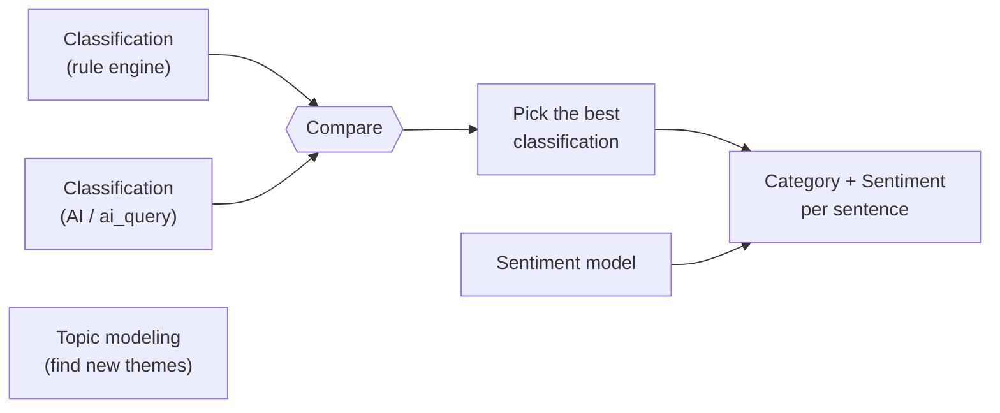
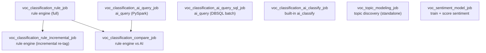

# GM Voice of Customer (VOC) — Databricks POC

A proof of concept for analyzing GM contact-center call transcripts on
**Databricks**, to see whether it can match GM's current **Qualtrics XM Discover**
setup. Everything works at the **sentence level**: each sentence gets one or more
**categories**, and optionally a **sentiment**.

A quick note on terms (as XM Discover uses them):

- **Category model** — the set of predefined categories (our topics + their rules).
- **Category** — one bucket a sentence can be assigned to.
- **Classification** — the process of assigning sentences to categories.
- **Topic modeling** — *discovering* new topics from the data (no predefined list).
- **Sentiment analysis** — how the customer feels (a separate, parallel layer).

## The tracks

Two tracks do the **same job** (classification into the category model) in
different ways, so we can **compare them and pick the best**. A third does
**topic modeling** (finds new themes). A fourth does **sentiment** and is used
**alongside** whichever classification approach wins.

| Track | Job it does | How it works | Role |
|-------|-------------|--------------|------|
| **Classification (rule engine)** | Classification | Keyword/boolean category rules (the same logic GM uses today). Multi-label + hierarchy roll-up. Same answer every time; easy to explain. **Full** run + an **incremental** re-tag when rules change. | Control / bake-off |
| **Classification (AI)** | Classification | A hosted **LLM reads each sentence** and assigns all applicable categories (multi-label + roll-up, same shape as the rule engine). Primary path is `ai_query` + a category-definition prompt; a built-in `ai_classify` variant and a DBSQL-batch variant exist for comparison. | Compared with rule engine |
| **Topic modeling** | Topic discovery | Groups similar sentences to surface themes nobody predefined (embeddings + clustering). | Exploratory (standalone) |
| **Sentiment model** | Sentiment | A trained model rating each sentence Very Negative → Very Positive. | Used together with classification |

**How to read this:** rule engine vs. AI is a **bake-off** for classification — a
separate comparison job scores how much they agree, so GM can choose one (or blend
them). Topic modeling is exploratory (it invents its own themes, so it isn't
compared). The sentiment model is complementary — it adds "how does the customer
feel?" on top of "what category is this?"



---

## The category model (four categories)

Chosen from GM's category hierarchy because they have enough volume to test with:

1. Contact Center → Dissatisfied With Advisor → **Confusing / Makes No Sense**
2. Contact Center → Dissatisfied With Advisor → **Inaccurate Information**
3. Loyalty → Rewards → **Points**
4. Loyalty → Rewards → Points → **Redeem**

Before classifying, we keep only **English, audio, customer-side** sentences (and
drop automated/IVR boilerplate). Each category is defined by rules (words that
must appear, words that must not, phrases, etc.).

---

## What each track does, in plain terms

**Classification (rule engine).** Re-creates GM's existing category rules. It's
deterministic (same input → same output) and fully explainable — you can see
exactly which words assigned a category. Downside: someone maintains the rules,
and it misses wording the rules didn't anticipate. Two ways to run it:
- **Full** (`voc_classification_rule_job`) — tags the whole in-scope corpus.
- **Incremental** (`voc_classification_rule_incremental_job`) — when you tweak a
  rule, it re-tags **only the sentences and columns that change** and merges them
  into the existing table in place, instead of the hours-long full re-run.

**Classification (AI).** A hosted LLM reads each sentence and assigns the
categories by *meaning*, so it catches paraphrases the rules miss. No keyword
upkeep, but it costs per call and isn't perfectly repeatable. Three
implementations (so they can be compared) — see `classification_ai/README.md`:
`ai_query` on PySpark, `ai_query` as **DBSQL batch** (the scalable path), and the
built-in `ai_classify` function. Default endpoint: `databricks-claude-sonnet-4-6`.

**Topic modeling.** Uses `ai_query` embeddings + clustering + `ai_gen` to **find
themes nobody predefined** — the exploratory counterpart to classification.

**Sentiment model.** A trained model (fine-tuned DistilBERT) rating sentiment on a
5-point scale, with a simple word-list method ("VADER") as a baseline. Registered
in MLflow so GM would own it and run it cheaply. We have no labeled examples yet,
so we bootstrap training labels with an LLM — treat it as a starting model to
refine once people review real data.

---

## Repository layout

```
gm_voc/
├── classification_rule_engine/  Rule-engine classification: full job + incremental re-tag
├── classification_ai/           Three AI classifiers (ai_query / DBSQL batch / ai_classify) + compare
├── topic_modeling/              Topic discovery (embeddings + clustering)
├── sentiment_model/             Sentiment training + scoring
├── shared/                      category_model.json + helper scripts
├── docs/                        architecture diagrams + write-ups + deck generator
├── test_data/                   sample + demo CSVs
└── databricks.yml               Databricks Asset Bundle (defines the jobs)
```

The rule logic is plain Python (no Spark), so the **same code** runs at scale on
Databricks and can be tested on a laptop.

---

## Data

- **Inputs:** a sentence-level transcript table and a call-level metadata table.
- **Join:** `sentence.natural_id == metadata.natural_id`.
- **Grain:** one row per sentence (the `words` column).

> **Grain matters for comparisons.** GM's dashboards and Qualtrics count
> **documents / calls** (`COUNT(DISTINCT id_verbatim)`), while a raw sentence count
> (`COUNT(*)`) is larger (a call has several sentences). Compare like-for-like at
> the **call grain** — this reconciled our tag counts with Qualtrics.

---

## How it runs

Eight Databricks jobs (defined in `databricks.yml`):



**Classification — rule engine**
- **`voc_classification_rule_job`** → writes `voc_classification_rule_tags` (+ `_frequencies`)
- **`voc_classification_rule_incremental_job`** → after a rule change, re-tags only
  the affected sentences/columns and merges them **into the same tags table**
  (keeps a `…__rules_snapshot`). See `classification_rule_engine/README.md`.

**Classification — AI** (each writes its own table so all can be compared)
- **`voc_classification_ai_query_job`** → `voc_classification_ai_query_tags`
- **`voc_classification_ai_query_sql_job`** → `voc_classification_ai_query_sql_tags`
- **`voc_classification_ai_classify_job`** → `voc_classification_ai_classify_tags`

**Comparison & complementary tracks**
- **`voc_classification_compare_job`** → reads a rule table + an AI table, writes
  the comparison (run it *after* the classification jobs)
- **`voc_topic_modeling_job`** → discovered themes (independent, exploratory)
- **`voc_sentiment_model_job`** → trains + scores sentiment (independent, GPU)

The AI classification jobs are **scoped to a single day** (`ai_classify_date`) and
the DBSQL-batch jobs need a **SQL warehouse** (`sql_warehouse_id`); see
`docs/DEPLOYMENT.md` for the bundle variables.

### Run on Databricks

```bash
databricks bundle deploy -t sandbox -p <profile>

databricks bundle run voc_classification_rule_job              -t sandbox -p <profile>
databricks bundle run voc_classification_rule_incremental_job  -t sandbox -p <profile>  # after a rule change
databricks bundle run voc_classification_ai_query_job          -t sandbox -p <profile>
databricks bundle run voc_classification_ai_query_sql_job      -t sandbox -p <profile>  # scalable AI path
databricks bundle run voc_classification_ai_classify_job       -t sandbox -p <profile>
databricks bundle run voc_classification_compare_job           -t sandbox -p <profile>  # after the above
databricks bundle run voc_topic_modeling_job                   -t sandbox -p <profile>  # independent
databricks bundle run voc_sentiment_model_job                  -t sandbox -p <profile>
```

### Run the rule engine locally (no cluster)

```bash
python3 classification_rule_engine/test_rule_engine.py            # unit tests (46/46)
python3 classification_rule_engine/run_local.py --out outputs/    # classify the sample CSVs

# demo data that actually contains the categories:
python3 shared/make_demo_fixture.py
python3 classification_rule_engine/run_local.py \
  --sentences test_data/demo_sentence_level.csv \
  --metadata  test_data/demo_metadata.csv --out outputs_demo/
```

---

## Output tables (`daria_krasavina.gm_voc` by default; derived from the bundle catalog/schema)

| Table | From | Contents |
|-------|------|----------|
| `voc_classification_rule_tags` (+ `_frequencies`) | rule engine | one 0/1 column per category (leaves + rolled-up parents) + the words that assigned them |
| `voc_classification_rule_tags__rules_snapshot` | rule engine (incremental) | the rules the tags table was last built with (used to diff on the next incremental run) |
| `voc_classification_ai_query_tags` | AI — `ai_query` (PySpark) | one 0/1 column per category (multi-label + roll-up) + the raw category list the LLM returned |
| `voc_classification_ai_query_sql_tags` | AI — `ai_query` (DBSQL batch) | same shape as above |
| `voc_classification_ai_classify_tags` | AI — built-in `ai_classify` | one 0/1 column per category (single best label + roll-up) |
| `voc_topicmodeling_themes` / `voc_topicmodeling_assignments` | topic modeling | new themes found in the data |
| `voc_classification_comparison` | compare | how much a rule table and an AI table agree, per category |
| `voc_sentiment_scored` | sentiment | sentiment per sentence (trained model + baseline) |

---

## Status

- **Classification (rule engine):** built, **46/46** unit tests pass (rule syntax +
  incremental planning), validated locally. Full and incremental jobs deployed.
- **Classification (AI):** three implementations run on Databricks and write tags;
  `ai_query` DBSQL-batch is the scalable path. Best quality with
  `databricks-claude-sonnet-4-6` + a tightened prompt.
- **Topic modeling:** runs on Databricks.
- **Sentiment model:** training/scoring jobs run on Databricks; baseline runs locally.
- All jobs are deployed to the Databricks sandbox.

**Important:** the provided sample data is synthetic OnStar dialogue that doesn't
contain the four categories, so a run on it correctly assigns **0** categories. The
demo fixture shows classification working end-to-end. Meaningful results need real
transcripts.

## Next steps

1. Load real, representative data and rerun all tracks.
2. Compare the two classifiers against GM's existing tags (accuracy per category).
3. Review the topic-modeling themes with the team.
4. Have people label a set of real examples, then retrain the sentiment model on them.
5. Measure cost and speed at full volume (see the scaling notes in `classification_ai/README.md`).

---

*See `docs/ARCHITECTURE.md` for detailed diagrams and the per-track write-ups.*
