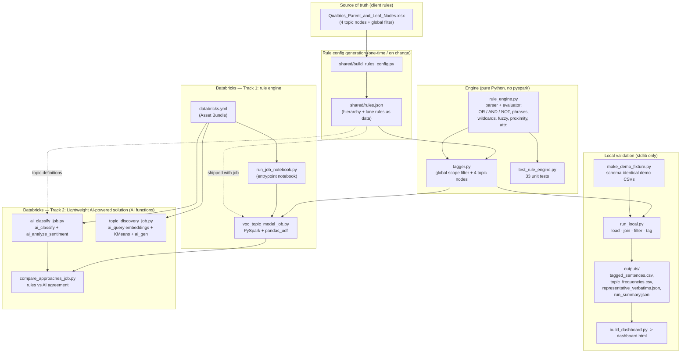
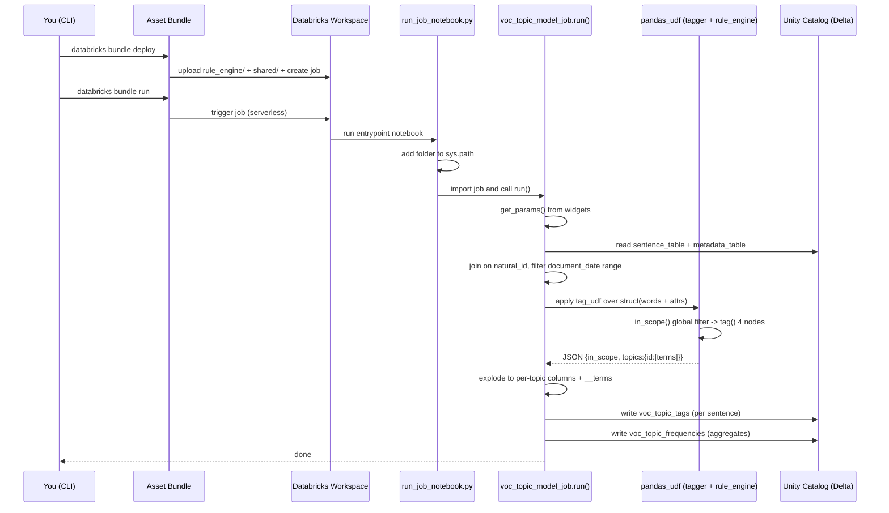
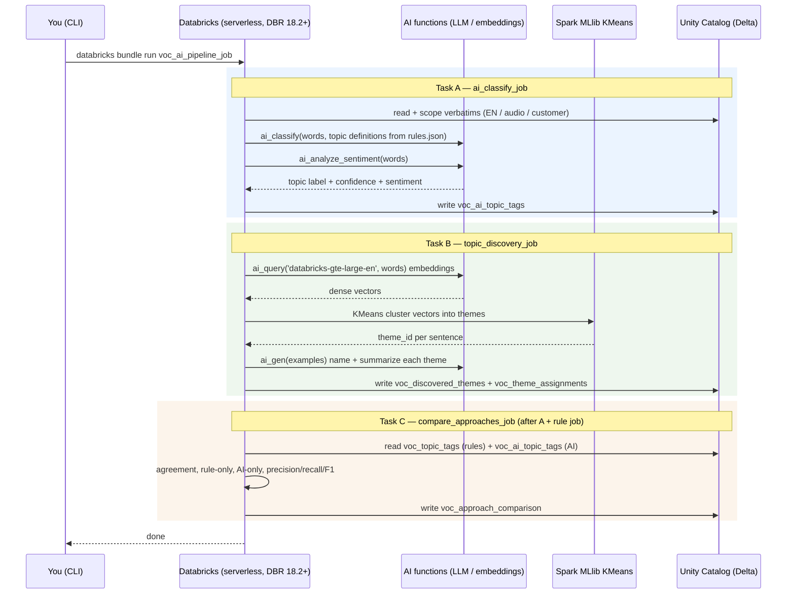

# GM Voice of Customer (VOC) — Databricks POC

Proof of concept evaluating whether **Databricks** can replicate — and improve on —
GM's **Qualtrics XM Discover** topic tagging over contact-center call transcripts.

It classifies call transcripts by topic at **sentence grain**, using two
complementary tracks:

1. **Rule engine** — a deterministic re-implementation of GM's XM Discover
   swim-lane rules (the control replica).
2. **Lightweight AI-powered solution** — Databricks' native AI functions
   (`ai_classify`, `ai_analyze_sentiment`, `ai_query` embeddings + KMeans,
   `ai_gen`) — no custom model to train, host, or maintain.

Both write per-sentence topic tags so results can be validated 1:1 against GM's
current Qualtrics output.

---

## The four POC topics

Two branches of GM's Automotive Production Model (APM) hierarchy, chosen for
meaningful volume, encoded verbatim from the source workbook:

1. Contact Center → Dissatisfied With Advisor → **Confusing / Makes No Sense**
2. Contact Center → Dissatisfied With Advisor → **Inaccurate Information**
3. Loyalty → Rewards → **Points**
4. Loyalty → Rewards → Points → **Redeem**

A global "DBX POC" filter scopes to **English + audio + customer-side** verbatims
and strips IVR/boilerplate before any topic is applied.

---

## The two tracks (and the maintenance trade-off)

| Track | Approach | What it is | Trade-offs |
|-------|----------|-----------|-----------|
| **1** | Rule engine | Faithful XM Discover swim-lane replica (OR/AND/NOT, phrases, wildcards, fuzzy, proximity). Deterministic, explainable, zero model cost, exact control replica. | Manual rule upkeep; misses novel phrasing. |
| **2a** | AI classification | `ai_classify` (a hosted LLM) assigns each sentence to a topic, steered by the topic's business definition; `ai_analyze_sentiment` adds sentiment. | Non-deterministic; per-call cost. |
| **2b** | Topic discovery | Unsupervised: `ai_query` embeds sentences, **Spark MLlib KMeans** clusters by meaning, `ai_gen` auto-names themes — finds themes nobody defined. | Clusters need human interpretation. |
| — | Comparison | Agreement analysis: rules vs. AI per topic (overlap, precision/recall/F1). | Uses rules as *proxy* control, not GM's true XM Discover output. |

Track 2 is a **lightweight AI-powered solution**, not a custom-trained model:
the AI functions call hosted models, so GM does not own long-term model
maintenance. (Note: the KMeans discovery step *does* train a real model; a
custom **supervised** classifier is intentionally out of scope and could be a
later track.)

---

## Repository layout

```
gm_voc/
├── rule_engine/     Track 1 — rule_engine.py, tagger.py, voc_topic_model_job.py,
│                    run_job_notebook.py, run_local.py, build_dashboard.py,
│                    test_rule_engine.py
├── ai_solution/     Track 2 — ai_classify_job.py, topic_discovery_job.py,
│                    compare_approaches_job.py + 3 run_*_notebook.py entrypoints
├── shared/          rules.json (topic rules as data) + build_rules_config.py +
│                    make_demo_fixture.py — used by both tracks
├── docs/            README, ARCHITECTURE, LIGHTWEIGHT_AI_SOLUTION,
│                    VALIDATION_SUMMARY, architecture_diagram.html
├── test_data/       sample + demo CSVs
└── databricks.yml   Asset Bundle: voc_topic_model_job + voc_ai_pipeline_job
```

`rule_engine.py` and `tagger.py` **never import pyspark**, which is exactly why
the same matching logic runs inside a Spark `pandas_udf` on the cluster *and* is
unit-testable on a laptop with no JVM.

---

## Data

- **Inputs** (Unity Catalog): a sentence-level transcript table and a call-level
  metadata table.
- **Join:** `sentence.natural_id == metadata.natural_id` (verified 1:1 on the
  sample; `id_document == case_id == document_id` is an equivalent key).
- **Grain:** sentence-level (the `words` column).
- **Date range:** `document_date` in 2025-07-01 … 2026-06-30.

---

## Architecture

### 1. Component map & build-time flow



### 2. Runtime execution order — rule track (`voc_topic_model_job`)



### 3. Runtime execution order — lightweight AI-powered solution (`voc_ai_pipeline_job`)



> A rendered HTML version of these diagrams is in `docs/architecture_diagram.html`.

---

## Running

### Locally (rule engine, no cluster needed)

```bash
# regenerate rules from the workbook (only if the workbook changed)
python3 shared/build_rules_config.py

# unit tests
python3 rule_engine/test_rule_engine.py

# run over the provided sample CSVs
python3 rule_engine/run_local.py --out outputs/

# demo run that actually tags (schema-identical realistic verbatims)
python3 shared/make_demo_fixture.py
python3 rule_engine/run_local.py \
  --sentences test_data/demo_sentence_level.csv \
  --metadata  test_data/demo_metadata.csv --out outputs_demo/
python3 rule_engine/build_dashboard.py --out outputs_demo/
```

### On Databricks (both tracks)

```bash
databricks bundle deploy -t sandbox -p <profile>

# Track 1 (rules) — produces the control tags the comparison needs
databricks bundle run voc_topic_model_job -t sandbox -p <profile>

# Track 2 (AI classify + discovery + compare)
databricks bundle run voc_ai_pipeline_job -t sandbox -p <profile>
```

Table names and date range are job parameters in `databricks.yml`. The AI track
requires **serverless compute + Databricks Runtime 18.2+** in a Model-Serving
region, and AI functions are **pay-per-token** (both AI jobs default to a
bounded `sample_limit`).

---

## Output tables (`daria_krasavina.gm_voc`)

| Table | Produced by | Contents |
|-------|-------------|----------|
| `voc_topic_tags` | rules | per-sentence topic flags + matched terms ("chicklets") |
| `voc_topic_frequencies` | rules | topic counts |
| `voc_ai_topic_tags` | AI classify | per-sentence AI topic + confidence + sentiment |
| `voc_discovered_themes` | discovery | emergent themes with names/summaries |
| `voc_theme_assignments` | discovery | sentence → theme_id |
| `voc_approach_comparison` | compare | rules-vs-AI agreement per topic |

---

## Status & key findings

- **Track 1 (rules):** built, **33/33 unit tests pass**, validated end-to-end locally.
- **Track 2 (AI solution):** ai_classify, topic-discovery, and comparison jobs
  built and compile; wired into the bundle.
- Both jobs **deployed** to the Databricks sandbox as an Asset Bundle.
- **The provided sample data is synthetic** (OnStar roadside dialogue, ~40
  distinct sentences, none containing the four topics' vocabulary), so a real
  run correctly tags **0** sentences. The demo fixture proves the engine handles
  the hard cases (dealer exclusion, negation, agent-side filtering, and
  "he wants to redeem his points" → Points but not Redeem).
- Data join and scope filter verified (~43% of the sample is in scope).

## Recommended next steps

1. Load real, de-identified representative data into the POC schema and rerun both tracks.
2. Compare both tracks against GM's XM Discover control tags per node (precision/recall).
3. Review the discovered themes with SMEs for emergent topics beyond the four nodes.
4. Capture cost (DBU + AI token cost) and throughput at target volume; run the rerun-repeatability benchmark.
5. Swap the sentence-ordering proxy for GM's multi-field ranking logic once provided.

---

*See `docs/` for the detailed architecture, the lightweight-AI-solution write-up,
and the validation summary.*
