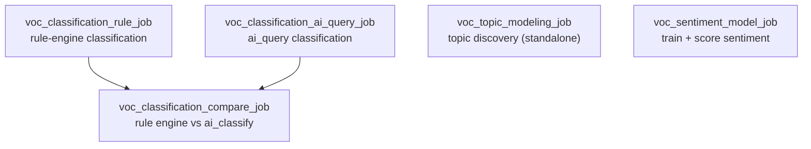

# GM Voice of Customer (VOC) — Databricks POC

A proof of concept for analyzing GM contact-center call transcripts on
**Databricks**, to see whether it can match GM's current **Qualtrics XM Discover**
setup. Everything works at the **sentence level**: each sentence gets one or more
**categories**, and optionally a **sentiment**.

A quick note on terms (as XM Discover uses them):

- **Category model** — the set of predefined categories (our topics + their rules).
- **Category** — one bucket a sentence can be assigned to.
- **Classification** — the process of assigning sentences to categories.
- **Topic modeling** — *discovering* new topics from the data (no predefined list).
- **Sentiment analysis** — how the customer feels (a separate, parallel layer).

## The tracks

Two tracks do the **same job** (classification into the category model) in
different ways, so we can **compare them and pick the best**. A third does
**topic modeling** (finds new themes). A fourth does **sentiment** and is used
**alongside** whichever classification approach wins.

| Track | Job it does | How it works | Role |
|-------|-------------|--------------|------|
| **Classification (rule engine)** | Classification | Keyword/boolean category rules (the same logic GM uses today). Multi-label + hierarchy roll-up. Same answer every time; easy to explain. | Compared with ai_classify |
| **Classification (ai_classify)** | Classification | An LLM reads each sentence and assigns all applicable categories (multi-label + roll-up, same shape as the rule engine). | Compared with rule engine |
| **Topic modeling** | Topic discovery | Groups similar sentences to surface themes nobody predefined (embeddings + clustering). | Exploratory (standalone) |
| **Sentiment model** | Sentiment | A trained model rating each sentence Very Negative → Very Positive. | Used together with classification |

**How to read this:** rule engine vs. ai_classify is a **bake-off** for
classification — a separate comparison job scores how much they agree, so GM can
choose one (or blend them). Topic modeling is exploratory (it invents its own
themes, so it isn't compared). The sentiment model is complementary — it adds
"how does the customer feel?" on top of "what category is this?"


---

## The category model (four categories)

Chosen from GM's category hierarchy because they have enough volume to test with:

1. Contact Center → Dissatisfied With Advisor → **Confusing / Makes No Sense**
2. Contact Center → Dissatisfied With Advisor → **Inaccurate Information**
3. Loyalty → Rewards → **Points**
4. Loyalty → Rewards → Points → **Redeem**

Before classifying, we keep only **English, audio, customer-side** sentences (and
drop automated/IVR boilerplate). Each category is defined by rules (words that
must appear, words that must not, phrases, etc.).

---

## What each track does, in plain terms

**Classification (rule engine).** Re-creates GM's existing category rules. It's
deterministic (same input → same output) and fully explainable — you can see
exactly which words assigned a category. Downside: someone maintains the rules,
and it misses wording the rules didn't anticipate.

**Classification (ai_classify).** Uses the Databricks `ai_classify` AI function:
an LLM reads a sentence and assigns it to the categories. No keyword upkeep and it
handles paraphrasing, but it costs a bit per call and isn't perfectly repeatable.

**Topic modeling.** Uses `ai_query` embeddings + clustering + `ai_gen` to **find
themes nobody predefined** — the exploratory counterpart to classification.

**Sentiment model.** A trained model (fine-tuned DistilBERT) rating sentiment on a
5-point scale, with a simple word-list method ("VADER") as a baseline. Registered
in MLflow so GM would own it and run it cheaply. We have no labeled examples yet,
so we bootstrap training labels with an LLM — treat it as a starting model to
refine once people review real data.

---

## Repository layout

```
gm_voc/
├── classification_rule_engine/  Classification via GM's category rules + its job
├── classification_ai/           Classification via ai_classify + the compare job
├── topic_modeling/              Topic discovery (embeddings + clustering)
├── sentiment_model/             Sentiment training + scoring
├── shared/                      category_model.json + helper scripts
├── docs/                        architecture diagrams + write-ups
├── test_data/                   sample + demo CSVs
└── databricks.yml               Databricks Asset Bundle (defines the jobs)
```

The rule logic is plain Python (no Spark), so the **same code** runs at scale on
Databricks and can be tested on a laptop.

---

## Data

- **Inputs:** a sentence-level transcript table and a call-level metadata table.
- **Join:** `sentence.natural_id == metadata.natural_id`.
- **Grain:** one row per sentence (the `words` column).

---

## How it runs

Five Databricks jobs (defined in `databricks.yml`):



- **`voc_classification_rule_job`** → writes `voc_classification_rule_tags`
- **`voc_classification_ai_query_job`** → writes `voc_classification_ai_query_tags`
- **`voc_classification_compare_job`** → reads both tag tables, writes the comparison
  (run it *after* the two above)
- **`voc_topic_modeling_job`** → writes discovered themes (independent, exploratory)
- **`voc_sentiment_model_job`** → trains + scores sentiment (independent)

### Run on Databricks

```bash
databricks bundle deploy -t sandbox -p <profile>

databricks bundle run voc_classification_rule_job    -t sandbox -p <profile>
databricks bundle run voc_classification_ai_query_job      -t sandbox -p <profile>
databricks bundle run voc_classification_compare_job -t sandbox -p <profile>   # after the two above
databricks bundle run voc_topic_modeling_job         -t sandbox -p <profile>   # independent
databricks bundle run voc_sentiment_model_job        -t sandbox -p <profile>
```

### Run the rule engine locally (no cluster)

```bash
python3 classification_rule_engine/test_rule_engine.py            # unit tests
python3 classification_rule_engine/run_local.py --out outputs/    # classify the sample CSVs

# demo data that actually contains the categories:
python3 shared/make_demo_fixture.py
python3 classification_rule_engine/run_local.py \
  --sentences test_data/demo_sentence_level.csv \
  --metadata  test_data/demo_metadata.csv --out outputs_demo/
```

---

## Output tables (`daria_krasavina.gm_voc`)

| Table | From | Contents |
|-------|------|----------|
| `voc_classification_rule_tags` | rule engine | one 0/1 column per category (leaves + rolled-up parents) + the words that assigned them |
| `voc_classification_ai_query_tags` | ai_classify | one 0/1 column per category (multi-label + roll-up) + sentiment |
| `voc_topicmodeling_themes` / `voc_topicmodeling_assignments` | topic modeling | new themes found in the data |
| `voc_classification_comparison` | compare | how much the two classifiers agree, per category |
| `voc_sentiment_scored` | sentiment | sentiment per sentence (trained model + baseline) |

---

## Status

- **Classification (rule engine):** built, 33/33 unit tests pass, validated locally.
- **Classification (ai_classify):** runs on Databricks and writes tags.
- **Topic modeling:** runs on Databricks.
- **Sentiment model:** training/scoring jobs run on Databricks; baseline runs locally.
- All jobs are deployed to the Databricks sandbox.

**Important:** the provided sample data is synthetic OnStar dialogue that doesn't
contain the four categories, so a real run correctly assigns **0** categories. The
demo fixture shows classification working end-to-end. Meaningful results need real
transcripts.

## Next steps

1. Load real, representative data and rerun all tracks.
2. Compare the two classifiers against GM's existing tags (accuracy per category).
3. Review the topic-modeling themes with the team.
4. Have people label a set of real examples, then retrain the sentiment model on them.
5. Measure cost and speed at full volume.

---

*See `docs/ARCHITECTURE.md` for detailed diagrams and the per-track write-ups.*
