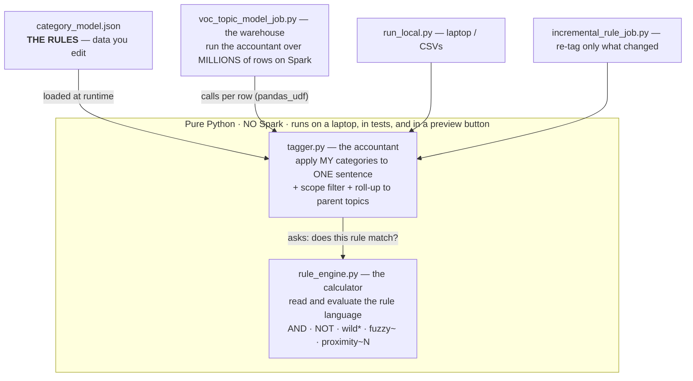
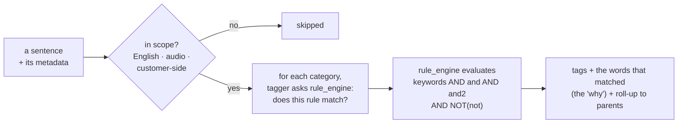

# Classification — Rule Engine

Deterministic classification that replicates GM's Qualtrics XM Discover category
rules. Reads GM's rule definitions and assigns each sentence to the matching
categories using keyword/boolean logic — the same answer every time, fully
explainable (you can see which words triggered each tag).

**This track uses NO machine-learning model.** It's a hand-written parser +
evaluator for GM's rule syntax. It is also the **control** the AI track is
compared against.

> **Visual walkthrough:** the architecture (data → engine → consumers), the 4-lane
> match logic, the full job pipeline, and the incremental re-tag flow are all
> diagrammed in the deep-dive deck — `GM_VOC_Technical_Deep_Dive.pptx`, generated
> by `docs/make_deepdive_pptx.py`.

---

## In plain terms: three code layers over one data file

The whole track is **three pieces of code doing one job each**, acting on **one file of rules**. The easiest way to hold it in your head:

| Layer | File | What it is | Everyday analogy |
|---|---|---|---|
| **The rules** | `shared/category_model.json` | Your categories and their keyword lanes — this is **data you edit**, not code | A **recipe book** you can rewrite anytime |
| **The calculator** | `rule_engine.py` | Understands the rule *language* (`AND`, `NOT`, `wild*`, `fuzzy~`, proximity `~2`) and can evaluate any rule against a sentence. Knows nothing about VOC or your categories. | A **calculator** — it computes any formula you type in |
| **The accountant** | `tagger.py` | Takes *your* categories from the JSON and uses the calculator to check one sentence against all of them (plus the scope filter and hierarchy roll-up) | An **accountant** who runs *your company's* formulas on one invoice |
| **The warehouse** | `voc_topic_model_job.py` | Runs the accountant across **millions** of sentences on Spark | A **warehouse full of accountants** doing it at scale |



**How one sentence actually gets tagged:**



### Why split it up? Why not just put everything in the Spark job?

You *could* put all of this inside `voc_topic_model_job.py` — it would even run. But keeping the logic (`rule_engine` + `tagger`) in their own files and **free of any Spark dependency** buys four things that matter a lot here:

1. **Test a rule in a fraction of a second, with no cluster.** The matching logic runs on a laptop (`run_local.py`) — and could run behind a "preview this rule" button in a UI. If it lived only inside the Spark job, you'd have to start a cluster (slow, and it costs money) just to check whether one rule tags one sentence.
2. **Unit-test the fiddly parts in isolation.** Proximity (`"hotel room"~2`), wildcards, and fuzzy matching are easy to get subtly wrong. Because they live in `rule_engine.py`, `test_rule_engine.py` can check them directly.
3. **One source of truth, reused everywhere.** The local runner, the Spark job, the incremental re-tag job, **and the AI tracks** all import the *same* `tagger`/`rule_engine`. No copy-paste, so they can't drift apart and start disagreeing.
4. **Local equals production, guaranteed.** The *same* pure-Python code runs on your laptop and on the cluster, so a local preview is byte-identical to what production does — no "worked on my machine, tagged differently in prod."

### What actually changes when the rules change?

**Only `shared/category_model.json`.** `rule_engine.py` is frozen machinery — it's the language *interpreter*, it has **zero rules baked into it**, and it never even opens the file. `tagger.py` is the one that reads the JSON and feeds each rule string into the calculator. That clean separation is exactly what makes a no-code, UI-based rule editor feasible: a business user edits *data* (keyword lanes), and the engine underneath never moves.

> One structural caveat: editing a rule's *keywords* touches only the JSON. But **adding/removing a whole category** also adds/removes a column in the output table (and anything hardcoding category ids downstream), and **changing the global scope filter** forces a full re-tag instead of an incremental one.

---

## How the pieces fit together

```
shared/category_model.json          the rules (data) — read at runtime
        │
        ▼
rule_engine.py   parses + evaluates GM's rule syntax  (pure Python, no Spark)
        │
        ▼
tagger.py        applies scope filter + all categories + hierarchy roll-up
        │
        ├──► run_local.py             run locally over CSVs (no cluster)
        ├──► voc_topic_model_job.py   FULL run on Databricks at scale (pandas_udf)
        │            │
        │            ▼
        │    run_job_notebook.py      Databricks entrypoint that calls the job
        │
        └──► incremental_rule_job.py  INCREMENTAL re-tag after a rule change
                     │                (re-tags only affected sentences/columns)
                     ▼
             run_incremental_notebook.py   Databricks entrypoint
```

`rule_engine.py` and `tagger.py` **never import pyspark**, so the exact same
matching code runs locally (unit-tested) and inside the Spark job.

---

## When to run the incremental job vs. a full refresh

Editing a rule's **keywords** — including **adding a new keyword** — → run the
**incremental** job (`incremental_rule_job.py`). It's built for exactly this. The
instinct that "a new keyword could make *any* sentence qualify, so we must scan the
whole table" is correct — but that does **not** mean a full refresh:

- A rule-engine keyword is a **literal string**, so the incremental extracts the
  *new* keyword and runs a **cheap `rlike` substring pre-filter across the whole
  table** to find the rows that contain it (the **GAIN** candidates), plus the rows
  currently tagged `1` in the changed column (the **LOSS** candidates).
- It then runs the **full rule engine only on that bounded candidate set** — not on
  all ~2M rows — and `MERGE`s the result in place. So adding `"snowfall"` re-evaluates
  just the rows containing "snowfall" (+ the currently-tagged ones). Far cheaper than a
  full refresh, and correct (the candidate set is a provable superset of what can change).

**Run a FULL refresh (`voc_topic_model_job.py`) instead when:**

| Situation | Why full |
|---|---|
| The **global scope filter** changed | Scope moves for *every* row — the incremental **aborts** and asks for a full run |
| The new term **isn't a literal substring** — a proximity/fuzzy seed (`"…"~3`) or an attribute condition (`call_direction`, `cc_lob_mv`, …) | The incremental **auto-falls back to a full in-scope scan** of that column (`needs_full_scan`), so a full refresh is equivalent/cleaner |
| **Many** categories changed at once, or you want a clean rebuild | Simpler to just re-run |
| **No snapshot yet** (first run), or **adding/removing a whole category** you want fully populated | Nothing to diff / a new column spans all rows |

**Why this is a rule-engine advantage:** the cheap GAIN detection works only because
the rule *contains* the literal keyword. The `ai_classify` track has no literal term
(its "rule" is a semantic `ai_description`), so a broadening there can't be pre-filtered
— it needs a full re-score (`mode=full`) or a supplied keyword proxy (`mode=terms`). Same
question, opposite answer, because of *what* the rule is. See
[`../classification_ai/README.md`](../classification_ai/README.md).

---

## File-by-file

### `rule_engine.py` — the query-language engine (the core)
Implements GM's XM Discover rule syntax from scratch. Two stages:

1. **Parser** (`_lex`, `_Parser`, `parse_lane`) — turns a rule string like
   `(confusion NOT "no confusion"), confused, "makes no sense", bewilder*`
   into an **AST** (tree of `Node` objects).
2. **Evaluator** — each `Node` has a `.match(ctx)` that tests a sentence:

| Node / helper | Rule syntax it handles | Logic used |
|---|---|---|
| `Or` | comma / OR list | any child matches |
| `And` | `AND` | all children match |
| `Not` | `NOT` | base matches AND exclusion does not |
| `PhraseTerm` | word, `"exact phrase"`, `wild*`, `room?`, `fuzzy~`, `"a b"~3` | token/phrase match |
| `AttrTerm` | `_verbatimtype:agentverbatim`, `language:english` | attribute-value match |
| `_make_word_matcher` | wildcards `*` `?`, fuzzy `~` | regex + edit distance |
| `_levenshtein_le` / `_fuzzy_dist` | fuzzy `~` | Levenshtein edit distance |
| `_make_phrase_matcher` | exact phrase & proximity `~N` | contiguous match / N-word window |
| `Context` | — | tokenizes the sentence once, holds attrs |
| `CompiledNode.evaluate` | one category (4 lanes) | keywords AND and AND and2 AND NOT not |

Output per category: matched (bool) + the list of matched terms ("chicklets").

### `tagger.py` — applies the model to a sentence
- `find_category_model()` / `load_rules()` — locate + load `category_model.json`
  (searches sibling `shared/` and flat cluster layouts).
- `build_ancestor_map()` — maps each category to its parents (for roll-up).
- `Tagger.in_scope()` — the global "DBX POC" filter: English + audio +
  customer-side + strips IVR/boilerplate (a big NOT-lane).
- `Tagger.tag()` — **multi-label**: returns every category a sentence matches,
  then **rolls up** to ancestor categories (a hit on Points-Redeem also marks
  Points → Rewards → Loyalty), mirroring XM Discover's category hierarchy.
- `topic_ids()` / `topic_meta()` — all categories (leaves + parents) for output.

### `voc_topic_model_job.py` — the Databricks/PySpark job
The production run. Logic in order:
1. `get_params()` — reads job params/widgets/argv (table names, dates,
   `sample_limit`).
2. `load_and_join()` — **scope-filters the sentence table in SQL first**
   (language/source/verbatimtype/date) so the slow step sees only in-scope rows,
   then left-joins the deduped metadata.
3. `make_tag_udf()` — a **`pandas_udf`** that runs `tagger.tag()` per row and
   returns JSON `{in_scope, topics:{id:[terms]}}`. *(This is the performance
   hotspot — Python matching per row.)*
4. `run()` — applies the UDF, explodes results into one 0/1 column + a
   `__terms` column per category, keeps only in-scope rows, writes
   `voc_classification_rule_tags`, and writes the per-category counts to
   `voc_classification_rule_frequencies`.

### `run_job_notebook.py` — Databricks entrypoint
Thin notebook: puts the folder on `sys.path`, imports the job, calls `run()`.

### `incremental_rule_job.py` — incremental re-tag after a rule change
Avoids the hours-long full re-run when you only tweak a rule. It re-tags **only
the sentences and columns a rule change can affect**, and `MERGE`s them into the
existing tags table **in place** — existing sentences with unaffected tags are
never touched. Safe because a tag is a deterministic function of the text + rule.

How it works:
1. Keeps a **rules snapshot** (`<tags_table>__rules_snapshot`) of what the table
   was last built with. First run **seeds** it and exits.
2. **Diffs** `category_model.json` vs the snapshot → changed / added / removed
   categories. If the **global scope filter** changed it aborts (scope moves for
   every row → run the full job).
3. **Affected columns** = changed/added/removed categories **+ their ancestors**
   (roll-up). Only these columns are written.
4. **Candidate rows** = rows currently tagged `1` in a changed column (may lose
   it) **∪** rows whose text contains a keyword term from the rule's *new*
   definition (may gain it) — a provable superset of all rows that can change.
   Fuzzy/attribute seeds that a text pre-filter can't bound fall back to a full
   in-scope scan of that one column.
5. Recomputes those columns for candidates with the **same tagger**, `MERGE`s in
   place, refreshes the frequency table, and updates the snapshot.

The diff / affected-column / pre-filter logic is pure Python and unit-tested
(see the `inc:` cases in `test_rule_engine.py`).

Typical flow:
```
# once, after the full job has populated the tags table:
databricks bundle run voc_classification_rule_incremental_job -t sandbox -p <profile> \
  --var="rule_tags_table_name=voc_classification_rule_tags_v2"   # seeds the snapshot
# edit shared/category_model.json (change a rule), then:
databricks bundle run voc_classification_rule_incremental_job -t sandbox -p <profile> \
  --var="rule_tags_table_name=voc_classification_rule_tags_v2"   # applies just the delta
```

### `run_incremental_notebook.py` — Databricks entrypoint (incremental)
Thin notebook: puts the folder on `sys.path`, imports the incremental job, `run()`.

### `run_local.py` — local driver (no cluster)
Stdlib-only. Loads the sample CSVs, joins on `natural_id`, applies the **same**
`tagger`, writes `tagged_sentences.csv` + frequency/summary files. Used to
validate rule fidelity without Databricks.

### `build_dashboard.py` — HTML review dashboard
Renders topic frequencies + representative verbatims (with matched-term
chicklets) from the local run outputs.

### `test_rule_engine.py` — unit tests
46 tests: every rule operator (OR/AND/NOT, phrases, wildcards, fuzzy, proximity,
attributes, negation edge cases) plus the incremental planning logic (diff,
affected-column roll-up, pre-filter extraction, full-scan fallbacks). All passing.

---

## Inputs / outputs

- **Reads:** sentence table + metadata table (joined on `natural_id`), and
  `shared/category_model.json`.
- **Writes:** `voc_classification_rule_tags` (one 0/1 column + `__terms` per
  category, in-scope rows only) and `voc_classification_rule_frequencies`
  (per-category counts).

## Performance note
~99.7% of the Spark job's time is the `pandas_udf` running Python rule-matching
per row. `pandas_udf` speeds the *data transfer* (Arrow), not the *compute*
(still Python). At very large scale the real fix is porting the matching to
native Spark `rlike`/boolean expressions — see the repo-level notes. The SQL
pre-filter in `load_and_join()` reduces how many rows reach the UDF.
