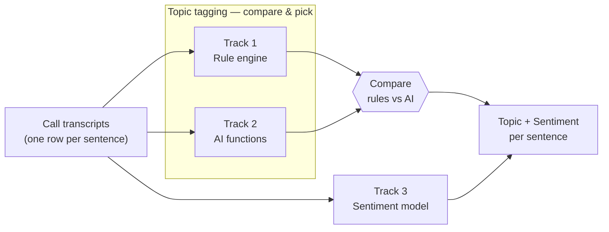
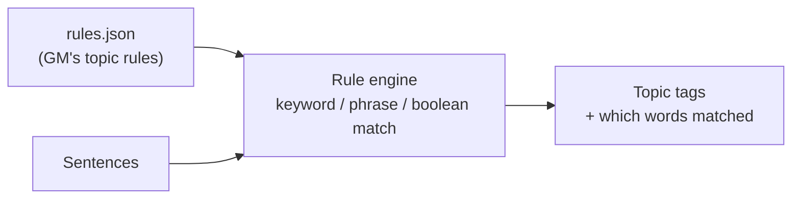
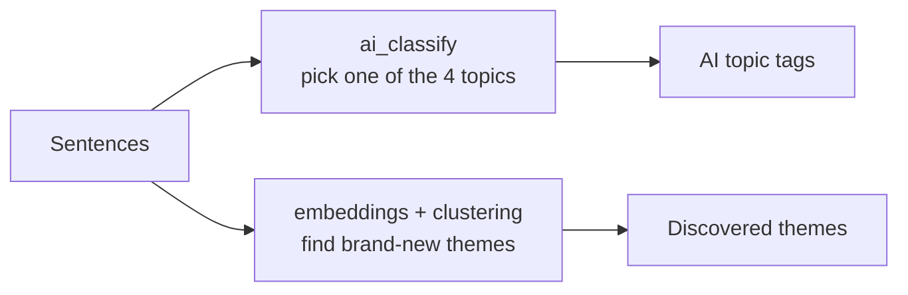
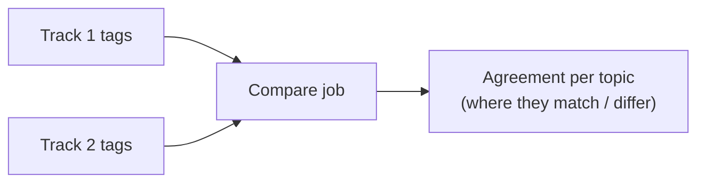
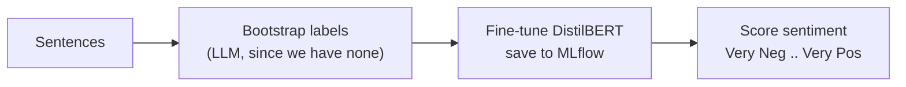

# GM VOC POC — Architecture

Simple diagrams of how the pieces fit together. They render on GitHub and in any
Mermaid viewer (e.g. https://mermaid.live).

There are **three tracks**. Tracks 1 and 2 both do **topic tagging** and are
**compared** so GM can pick the best. Track 3 does **sentiment** and is used
**alongside** the winner.

---

## 1. The big picture

---

## 2. Track 1 — Rule engine (topic tagging)

Deterministic and explainable. The rules come from GM's workbook; the engine
runs the same way locally and on Databricks.

---

## 3. Track 2 — AI functions (topic tagging + theme discovery)

An LLM assigns topics; a separate step groups sentences into themes nobody
defined. Flexible, but costs per call and isn't perfectly repeatable.

---

## 4. Compare — rules vs AI

Run after Tracks 1 and 2. Shows how closely the AI matches the rules so GM can
decide which to trust (or how to blend them).

---

## 5. Track 3 — Sentiment model

A trained model GM would own. A simple word-list baseline (VADER) is scored
alongside it for comparison. Trained on bootstrapped labels for now; refine on
real reviewed labels later.

---

## How the tracks relate (summary)

- **Tracks 1 & 2 = the same job (topics), compared.** Pick one or blend.
- **Track 3 = a different job (sentiment), complementary.** Use with the winner.
- Together you get, per sentence: **what the customer is talking about** + **how
  they feel** — which sets up questions like "how do customers feel about points
  redemption specifically?"
