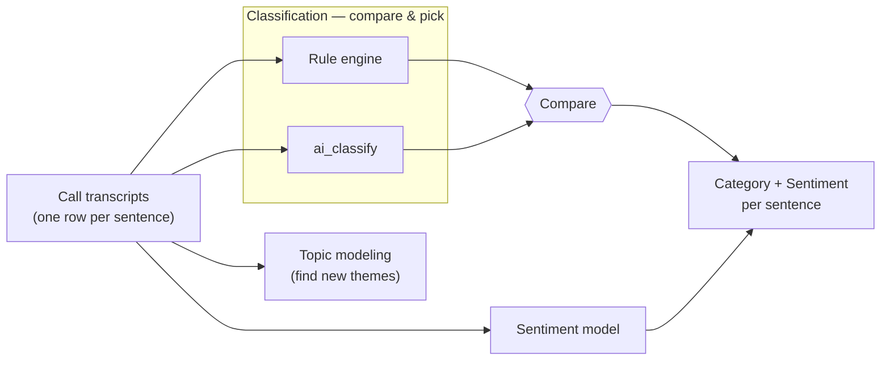
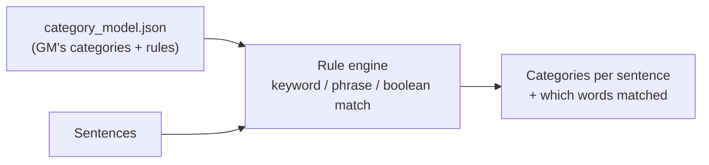
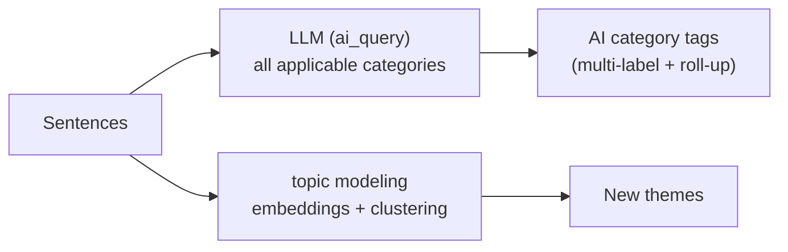
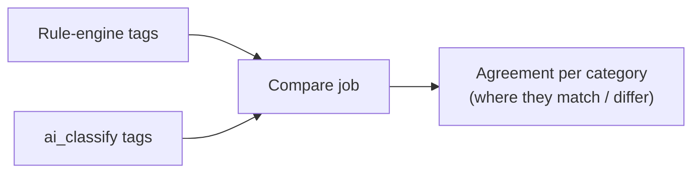
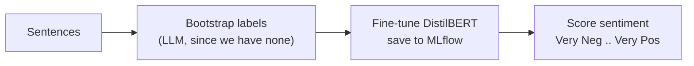

# GM VOC POC — Architecture

Simple diagrams of how the pieces fit together. They render on GitHub and in any
Mermaid viewer (e.g. https://mermaid.live).

Terms (as XM Discover uses them): a **category model** holds **categories**;
**classification** is the process of assigning sentences to those categories;
**topic modeling** discovers new themes; **sentiment** is a separate layer.

Two tracks both do **classification** and are **compared** so GM can pick the
best. **Topic modeling** is exploratory. The **sentiment model** is used
**alongside** the winner.

---

## 1. The big picture

---

## 2. Classification — rule engine

Deterministic and explainable. The category rules come from GM's workbook; the
engine runs the same way locally and on Databricks. **Multi-label** (a sentence
can get several categories) with **hierarchy roll-up** — a hit on a leaf like
"Points - Redeem" also counts toward its parents (Points → Rewards → Loyalty),
exactly like an XM Discover category model.

---

## 3. Classification — ai_classify (+ topic modeling)

The LLM returns **all** categories that apply to a sentence (multi-label), and
those roll up to parent categories — the same shape as the rule engine, so the
two are directly comparable. Topic modeling groups sentences into themes nobody
defined. Flexible, but costs per call and isn't perfectly repeatable.

---

## 4. Compare — rule engine vs ai_classify

Run after both classifiers. Shows how closely ai_classify matches the rules so GM
can decide which to trust (or how to blend them).

---

## 5. Sentiment model

A trained model GM would own. A simple word-list baseline (VADER) is scored
alongside it. Trained on bootstrapped labels for now; refine on real reviewed
labels later.

---

## How the tracks relate (summary)

- **Rule engine & ai_classify = the same job (classification), compared.** Pick one or blend.
- **Topic modeling = discovery**, standalone (no predefined categories to compare against).
- **Sentiment model = a different layer**, complementary. Use with the winner.
- Together you get, per sentence: **which category** + **how they feel** — which
  sets up questions like "how do customers feel about points redemption?"
