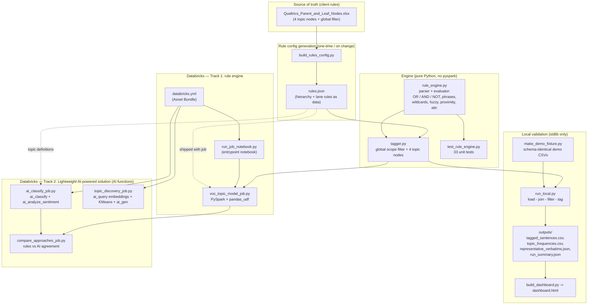
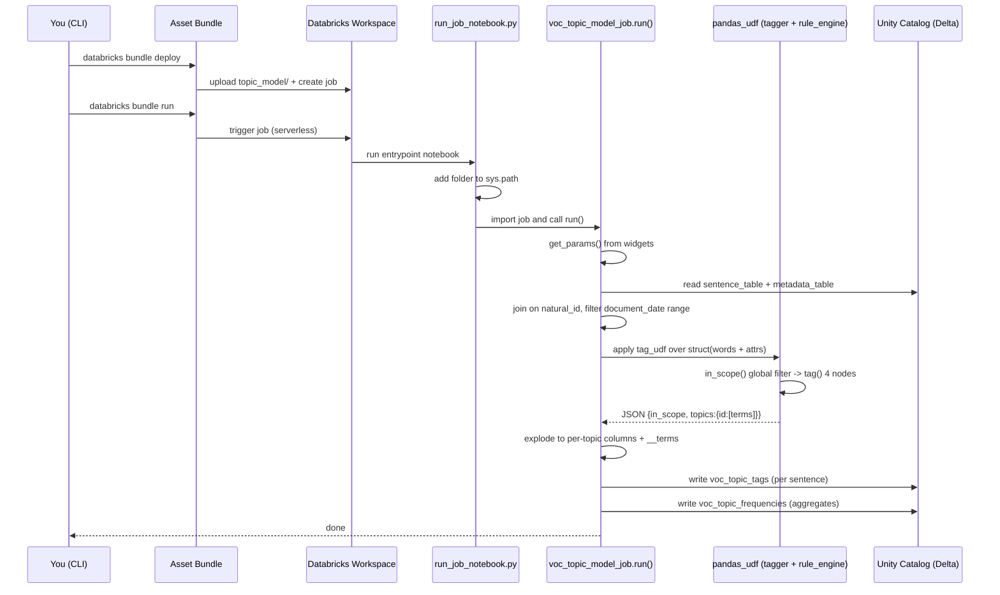
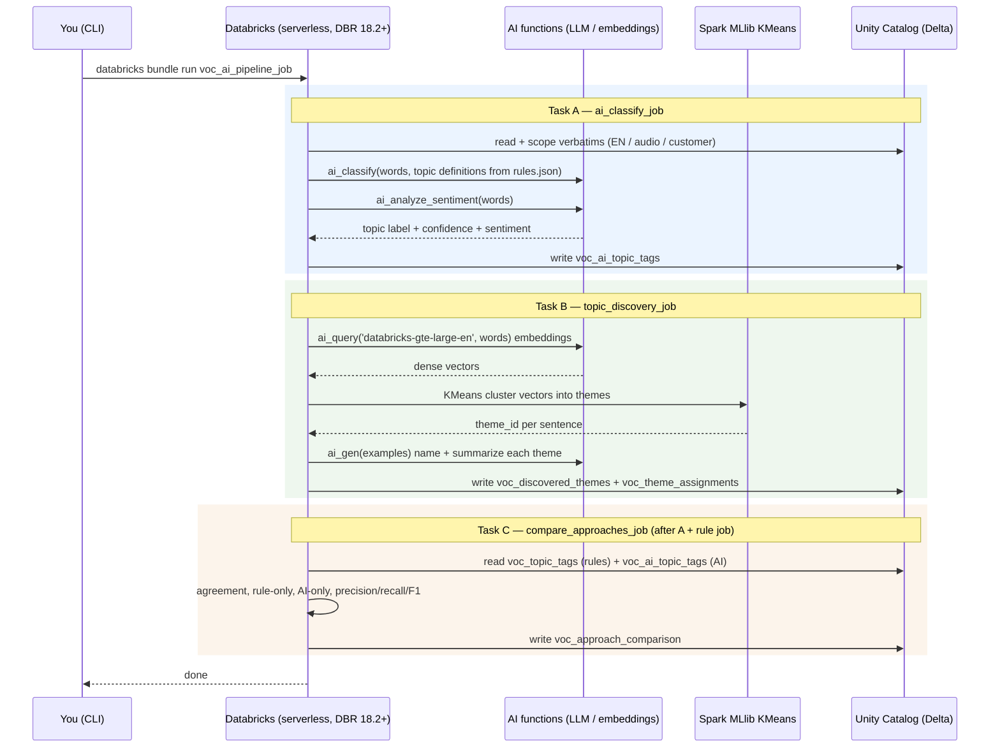
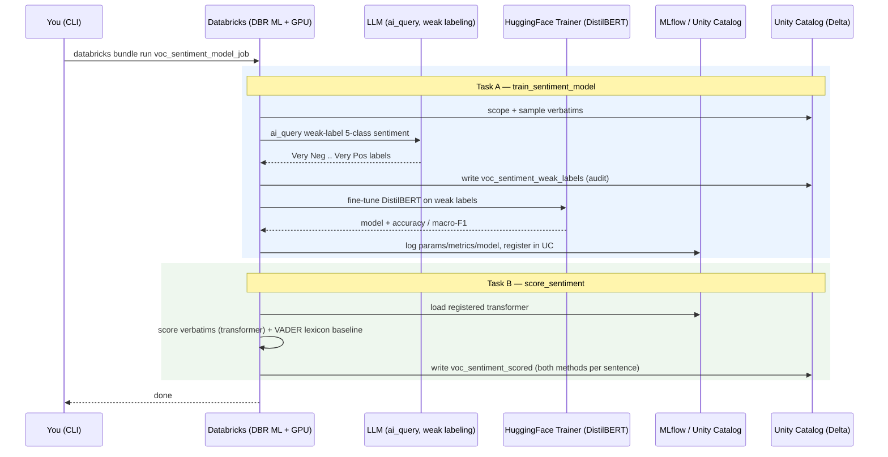

# GM VOC POC — Architecture (Mermaid)

Databricks replication of Qualtrics XM Discover, with three tracks: a
deterministic **rule engine**, a **lightweight AI-powered solution** built on
Databricks AI functions (`ai_classify`, `ai_analyze_sentiment`, `ai_query`
embeddings + KMeans, `ai_gen`), and a **trained transformer sentiment model**
(fine-tuned DistilBERT, 5-class, MLflow-tracked + VADER baseline).

These diagrams render natively on GitHub and in any Mermaid viewer
(e.g. https://mermaid.live). An HTML version is in `architecture_diagram.html`.

---

## 1. Component map & build-time flow

---

## 2. Runtime execution order — rule track (`voc_topic_model_job`)

---

## 3. Runtime execution order — lightweight AI-powered solution (`voc_ai_pipeline_job`)

---

## 4. Runtime execution order — trained sentiment model (`voc_sentiment_model_job`)

---

## Reading it

- **Build time:** the client Excel drives `rules.json`; the engine
  (`rule_engine.py` + `tagger.py`) is validated by tests and the local runner
  before it ever reaches Spark. The same `rules.json` topic definitions steer
  the AI classifier, so both tracks classify against identical topics.
- **Track 1 (rules):** the same engine runs inside the Spark `pandas_udf`, so
  local and production results are identical — deterministic, explainable, the
  XM Discover control replica.
- **Track 2 (lightweight AI-powered solution):** Databricks AI functions classify by meaning
  (`ai_classify`), add sentiment (`ai_analyze_sentiment`), and discover emergent
  themes (embeddings + KMeans + `ai_gen`) — no model to train or maintain. The
  compare job regresses AI against the rule control. Requires serverless compute
  + DBR 18.2+; AI calls are pay-per-token.
- **Track 3 (trained transformer sentiment):** weak-label 5-class sentiment with
  an LLM, fine-tune DistilBERT, and register it in MLflow / Unity Catalog — a
  model GM owns and serves at zero token cost. A VADER lexicon baseline mirrors
  the pre-transformer era. Requires DBR ML (GPU to train). See
  `SENTIMENT_MODEL.md`. This is the Qualtrics-faithful *trained* ML track — a
  single transformer, not an ensemble.
