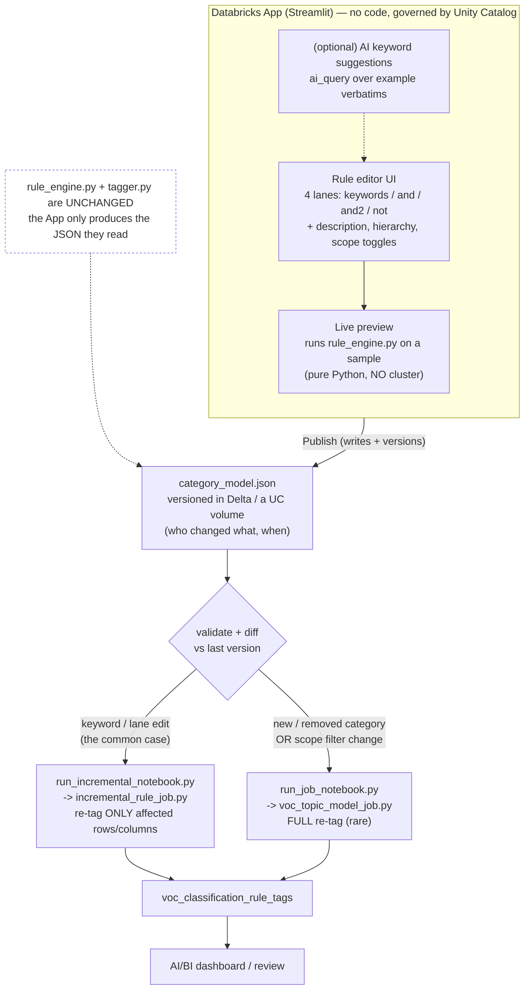
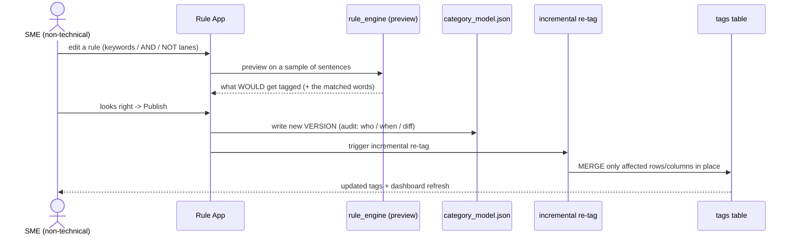

# Proposed: Simplified, No-Code Rule Creation via an App

**Status:** proposal / for discussion. Not built.

**Goal:** let a non-technical GM SME **create and adjust classification rules through
an easy, UI-based app** — no Python, no JSON editing, no cluster — while keeping the
tagging **deterministic and auditable** (the trend-reporting requirement) and reusing
the rule engine that already exists.

The core idea in one sentence: **the App is just a friendly editor for
`shared/category_model.json`.** Rules are defined/adjusted in the App → the App writes a
new, validated, versioned `category_model.json` → that file is fed to the existing rule
engine, and in day-to-day use we run the **incremental** re-tag (not the full job).

See [`classification_rule_engine/README.md`](../classification_rule_engine/README.md) for
how `category_model.json` → `tagger.py` → `rule_engine.py` already fit together. This doc
only adds the **authoring UI** on top of that unchanged machinery.

---

## Why

- The customer **likes the rule-based approach** (deterministic, explainable) but the
  **rules change over time**, and today changing them means editing rule logic by hand.
- The people who own the rules are **domain SMEs, not engineers** (no Python).
- They already understand the **XM Discover 4-lane model** (Include / And / And / Not),
  so the App should mirror that mental model rather than invent a new one.

Two principles make or break adoption:

1. **Mirror the 4 lanes they know** — keyword lists + a few toggles (exact phrase,
   wildcard `*`/`?`, proximity `~N`). No regex, no code.
2. **Preview before publish** — the SME must *see* what a change would tag on a sample
   **before** it goes live. This is the single most important feature.

---

## Architecture



**What's new vs. what's reused:**

| Piece | New or reused? |
|---|---|
| Rule editor UI, live preview, publish, version history | **New** (the App) |
| `category_model.json` (the data contract) | Reused — the App just writes it |
| `rule_engine.py`, `tagger.py` | **Reused, unchanged** — the frozen matching machinery |
| `incremental_rule_job.py` / `run_incremental_notebook.py` | Reused — the day-to-day publish target |
| `voc_topic_model_job.py` / `run_job_notebook.py` | Reused — only for structural changes |

---

## The edit → preview → publish → re-tag loop



The preview step calls the **same** `rule_engine.py`/`tagger.py` that production uses, so
"what the SME sees in preview" is byte-identical to "what production tags" — no surprises.

---

## The data contract (what the App writes)

The App never exposes JSON to the user — but under the hood it produces exactly the shape
the engine already reads:

```jsonc
{
  "global_filter": { "lanes": { "keywords": "...", "and": "...", "not": "..." } },
  "nodes": [
    {
      "id": "loyalty_rewards_points",
      "name": "Loyalty Rewards - Points",
      "path": ["Loyalty", "Loyalty - Rewards"],   // hierarchy (for roll-up)
      "description": "Mentions of GM My Rewards points ...",
      "comparison_target": true,
      "is_leaf": true,
      "lanes": {
        "keywords": "points, \"reward point\", voucher*",   // Include (OR)
        "and": "",                                          // And
        "and2": "",                                         // And #2
        "not": "\"point of view\", \"point of contact\""    // Not
      }
    }
    // ... one node per category
  ]
}
```

Each UI field maps to one lane; the App handles quoting, commas, and validation so the SME
just types words. That's the entire contract — nothing else in the codebase changes.

---

## Incremental vs. full re-tag — when each runs

The App decides automatically based on the diff, and tells the SME what to expect:

| Change the SME made | What runs | Why | Speed |
|---|---|---|---|
| Edit keywords / AND / NOT of an **existing** category | **Incremental** | Only that category's column + affected rows can change | Fast (minutes) |
| Edit a category's **description** only | Incremental (or no-op for the rule engine) | Doesn't change matching | Fast |
| **Add** or **remove** a category | **Full re-tag** | Adds/removes a table column; schema changes | Slower |
| Change the **global scope filter** | **Full re-tag** | Every row's in-scope status can change | Slowest |

The incremental job already handles this safely: it keeps a rules snapshot, diffs the new
JSON against it, re-tags only affected rows/columns via `MERGE`, and **aborts with a clear
message if the scope filter changed** (asking for a full run). The App surfaces that as a
friendly "this is a big change — it will re-run everything" confirmation.

---

## App components

1. **Rule editor** — hierarchy tree of categories; click one to edit its 4 lanes,
   description, and scope toggles. "Add category" / "remove category" flagged as structural.
2. **Live preview** — "Test on sample" runs `rule_engine` on N sample sentences and shows
   which get tagged and **which words matched** (the same "chicklets" the dashboard shows).
   Runs in-process, no cluster.
3. **Publish** — validates, writes a new **version** of `category_model.json` (Delta table
   or UC volume with time travel), records who/when/what-changed, and triggers the right job.
4. **Version history / rollback** — list past versions, diff them, restore one. This is the
   audit trail that supports deterministic, reproducible trend reporting.
5. **(Optional, v2) AI keyword suggestions** — given a topic and a few examples (or the
   untagged "global other" bucket), `ai_query` proposes candidate include/exclude terms; the
   SME reviews and accepts. **AI helps *author* the rules; the rules still run
   deterministically.** This directly eases the maintenance burden without giving up
   reproducibility.

---

## Governance & determinism

- Rules are **data in Unity Catalog** → UC permissions decide who can edit; audit logs and
  version history record every change.
- Tagging stays **fully deterministic** — same text + same rule version → same tags, every
  time. Pinning a rule version makes any historical run reproducible.
- `rule_engine.py`/`tagger.py` remain **frozen, reviewed code**; SMEs never touch code, only
  the rule data the App writes.

---

## Suggested build plan (phased)

| Phase | Deliverable | Notes |
|---|---|---|
| **0 — interim** | Spreadsheet-driven rules (the existing `Qualtrics_Parent_and_Leaf_Nodes.xlsx` shape) ingested by a job → `category_model.json` → incremental re-tag | SMEs can edit *today* while the App is built; weaker validation/preview |
| **1 — App MVP** | Streamlit App: 4-lane editor + live preview + publish → versioned JSON → incremental re-tag | The core value; deterministic + previewable |
| **2 — governance** | Version history, diff, rollback; structural-change handling (add/remove category, scope change → full re-tag) | Audit trail for trend reporting |
| **3 — AI assist** | "Suggest keywords" from examples / mine the global-other bucket | Eases maintenance; rules stay deterministic |

---

## Open questions (to confirm with GM)

- Is GM **replacing** Qualtrics/XM Discover, **complementing** it, or undecided? (If keeping
  it, a Qualtrics→JSON sync could be an alternative or additional authoring path.)
- How many SMEs edit rules, and how often? (Drives whether an approval/review step is needed
  before publish.)
- Should a publish require **approval** (maker/checker), or can an SME publish directly?
- Preview sample: fixed golden set, a random sample, or SME-chosen verbatims?

---

*Companion docs:* [`classification_rule_engine/README.md`](../classification_rule_engine/README.md)
(how the engine works) · [`LIGHTWEIGHT_AI_SOLUTION.md`](LIGHTWEIGHT_AI_SOLUTION.md) (the AI track).
